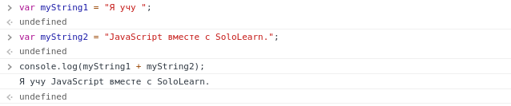

# Основные понятия

## Арифметические операторы

**Арифметические операторы** прекрасно выполняют арифметические функции с числами (как с литералами, так и с переменными).

| Оператор | Описание  | Пример                        |
| -------- | --------  | ----------------------------- |
| `+`      | Сложение  | `25 + 5 = 30`                 |
| `-`      | Вычитание | `25 - 5 = 20`                 |
| `*`      | Умножение | `10*20 = 200`                 |
| `/`      | Деление   | `20 / 2 = 10`                 |
| `%`      | Модуль    | `56 % 3 = 2`                  |
| `++`     | Инкремент | `var a = 10; a++; Now a = 11` |
| `--`     | Декремент | `var a = 10; a--; Now a = 9`  |

Ниже представлен пример **оператора сложения `(+)`** в действии:

```JavaScript
var x = 10 + 5;
console.log(x); // 15
```

Можно складывать столько чисел или переменных, сколько нужно:

```JavaScript
var x = 10;
var y = x + 5 + 22 + 45 + 6548;

console.log(y); // 6630
```

**`Вы можете получить результат строкового выражения с помощью функции eval(), которая принимает аргумент строкового выражения, например eval("10 * 20 + 8"), и возвращает результат. Если аргумент пуст, возвращается значение undefined.`**

---

## Умножение

Мы используем **оператор `*`** для умножения одного числа на другое.
**Например так:**

```JavaScript
var x = 10*5;
console.log(x); // 50
```

**`10*'5' или '10' * '5' даст тот же результат. Но попытка умножить число на строковые значения, не являющиеся числами, например 'sololearn' * 5, вернет NaN (не число, Not A Number).`**

---

## Деление

Мы используем **оператор `/`** для выполнения операций деления. **Типа этого:**
```JavaScript
var x = 100 / 5;
console.log(x); // 20
```

**`Остерегайтесь ситуаций, когда может произойти деление на 0, вычисления будут некорректными, если мы будем выполнять невозможные вычисления!`**

---

## Модуль

**Оператор модуля `(%)`** возвращает остаток от деления. Пример: 
```JavaScript
var x = 26 % 6;
console.log(x); // 2
```
Потому что у вас останется 2, когда вы разделите 26 на 6.

**`В JavaScript мы можем использовать оператор модуля для целых чисел И для чисел с плавающей запятой.`**

---

## Инкремент и Декремент

1) Оператор **инкремента** *увеличивает числовое значение своего операнда на 1*. Если поместить его перед операндом, он вернет увеличенное значение. При размещении после него он возвращает исходное значение, а затем увеличивает значение операнда.

2) Оператор **декремента** *уменьшает числовое значение своего операнда на 1*. Если поместить его перед операндом, он вернет уменьшенное значение. При размещении после операнда возвращает исходное значение, а затем уменьшает значение операнда.

Несколько примеров: 

| Оператор | Описание       | Пример                        | Результат           |
| -------- | -------------- | ----------------------------- | ------------------- |
| `var++`  | Постинкремент | `var a = 0; b = 10; a = b++;` | `a = 10 and b = 11` |
| `++var`  | Преинкремент  | `var a = 0; b = 10; a = ++b;` | `a = 11 and b = 11` |
| `var--`  | Постинкремент | `var a = 0; b = 10; a = b--;` | `a = 10 and b = 9`  |
| `--var`  | Преинкремент  | `var a = 0; b = 10; a = --b;` | `a = 9 and b = 9`   |

---

**`Как и в математике, которую вы изучали в школе, вы можете изменить порядок арифметических операций, используя круглые скобки.
Вот так: var x = (100 + 50) * 3;`**

---

## Операторы присваивания

Операторы присваивания используются для **присвоения значений переменным** JavaScript.

| Оператор | Примеры  | Эквивалентно |
| -------- | -------  | ------------ |
| `=`      | `x = y`  | `x = y`      |
| `+=`     | `x += y` | `x = x + y`  |
| `-=`     | `x -= y` | `x = x - y`  |
| `*=`     | `x *= y` | `x = x * y`  |
| `/=`     | `x /= y` | `x = x / y`  |
| `%=`     | `x %= y` | `x = x % y`  |

**`Вы можете использовать несколько операторов присваивания в одной строке, например x -= y += 9`**

---

## Операторы сравнения

Мы можем использовать **операторы сравнения**, чтобы узнать, отличаются ли переменные или значения.

Вы получите либо **истину**, либо **ложь**.
Например, **оператор равенства `(==)`** проверяет, равны ли значения операндов.

```JavaScript
var num = 10;

console.log(num == 8) // вернёт false
```

**`Вы можете сравнивать все типы данных с помощью операторов сравнения, они всегда возвращают истину или ложь.`**

Ознакомьтесь с этой таблицей, чтобы увидеть разбивку операторов сравнения.

| Оператор | Описание                     | Пример            |
| -------- | ---------------------------- | ----------------- |
| `==`     | Равно                        | `5 == '5' true`   | 
| `===`    | Идентичны (и одинаковый тип) | `5 === '5' false` | 
| `!=`     | Не равно                     | `5 != '5' false`  | 
| `!==`    | Не идентичны                 | `5 !== '5' true`  | 
| `>`      | Больше                       | `10 > 5 true`     | 
| `>=`     | Больше или равно             | `10 >= 5 true`    | 
| `<`      | Меньше                       | `10 < 5 false`    | 
| `<=`     | Меньше или равно             | `10 <= 10 true`   | 

---

## Логические операторы

**Логические** операторы, также известные как **булевые (boolean)** операторы оценивают выражение и возвращают **истину** или **ложь**.

Ознакомьтесь с таблицей ниже, чтобы увидеть более подробную информацию о логических операторах (**И, ИЛИ, НЕ**).


| Логические операторы                                                        |
| --------------------------------------------------------------------------- |
| `&&` возвращает `true`, если оба операнда `true`                            |
| `\|\|` возвращает `true`, если хотя бы один операнд `true`                    |
| `!` возвращает `true`, если операнд `false`, и `false`, если операнд `true` |

Рассмотрим пример для логического **И (`&&`)** : 
```JavaScript
console.log( (4 > 2) && (10 < 15) ) // true
```

Чтобы это выражение было истинным, должны выполняться **оба условия**.
- Первое условие определяет, больше ли 4, чем 2, что **верно (true)**.
- Второе условие определяет, будет ли 10 меньше 15, что также **верно (true)**.

И так как оба условия - true, то и `true && true = true`

---

## Условный (тернарный) оператор

**Условные или тернарные операторы** присваивают значение переменной на основе некоторого условия.

Вот как будет выглядеть синтаксис:

```JavaScript
variable = (condition) ? value1 : value2; 
```

**Пример:**

```JavaScript
var age = 19;
var isAdult = (age < 18) ? "Несовершеннолетний" : "Совершеннолетний";
console.log(isAdult) // "Совершеннолетний"
```

Если значение переменной `age` меньше 18, значение переменной `isAdult` будет `«Несовершеннолетний»`. В противном случае значение `isAdult` будет `«Совершеннолетний»`.

Тернарный оператор можно использовать и при выводе в консоль:

```JavaScript
var age = 19;
console.log((age < 18) ? "Несовершеннолетний" : "Совершеннолетний") // "Совершеннолетний"
```

**`С помощью логических операторов вы можете соединять столько выражений, сколько хотите или нужно.`**

---

## Строковые операторы

Один из самых полезных строковых операторов - **конкатенация**. Мы можем использовать **конкатенацию (представленную знаком `+`)** для построения строк, состоящих из нескольких меньших строк, или путем объединения строк с другими типами. Проверим это:

```JavaScript
var myString1 = "Я учу ";
var myString2 = "JavaScript вместе с SoloLearn.";

console.log(myString1 + myString2); // "Я учу JavaScript вместе с SoloLearn."
```

В этом примере объявляются и инициализируются две строковые переменные, а затем они объединяются. Просто ... но очень полезно!



**`Цифры в кавычках рассматриваются как строки: таким образом, «42» - это не число 42, это строка, состоящая из двух отдельных символов, 4 и 2.`**

---

## *Практика:* *Планировщик поездок*

Вам необходимо спланировать автомобильную поездку. Вы путешествуете со средней скоростью 40 миль в час.

Учитывая расстояние в милях в качестве входных данных (код для входа уже присутствует), выведите на консоль время, которое вам понадобится, чтобы преодолеть это расстояние в минутах.


```JavaScript
function main() {
    var distance = parseInt(readLine(), 10);
    // Ваш код ... 
    
}
```

**Пример ввода:**
150

**Пример вывода:**
225

**`Пояснение: чтобы преодолеть дистанцию, потребуется 150/40 = 3,75 часа, что эквивалентно 3,75 * 60 = 225 минут.`**

Готовый код можно посмотреть по этой [ссылке](./trip_planner.js).
