# Условные выражения и циклы

## Оператор if

Часто, когда мы пишем код, мы хотим выполнять разные действия в зависимости от разных условий.

И здесь на помощь приходят **условные выражения**.

Существует множество различных условных выражений, но мы начнем с одного из самых полезных: "если"

Мы используем **if**, чтобы указать блок кода, который мы хотим выполнить, если заданное условие истинно.

```JavaScript

if (условие) {
    ...
}
```

Операторы будут выполняться только в том случае, если указанное условие истинно. Давайте рассмотрим на пример:

```JavaScript
var myNum1 = 7;
var myNum2 = 10;

if (myNum1 < myNum2) {
    alert("JavaScript легко учить!");
}
```

**Результат:**

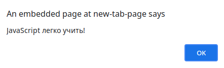

Вот еще немного подробностей об операторе if.

Это пример ложного условного оператора:

```JavaScript
var myNum1 = 7;
var myNum2 = 10;

if (myNum1 > myNum2) {
    alert("JavaScript легко учить!");
}
```

Поскольку условие оценивается как ложное, оператор предупреждения пропускается, и программа продолжает выполнение строки, следующей за закрывающей фигурной скобкой оператора if.

**`if пишется строчными буквами. If или IF - не работают.`**

---

## Оператор else

Итак, мы видели, что действие пропускается, когда блок кода, использующий оператор if, оценивается как false. Но что, если мы хотим обработать оба случая: когда выражение в if истинно и когда оно ложно? Ну, конечно же, мы используем оператор else!

Мы можем использовать оператор else, чтобы указать блок кода, который будет выполняться, если условие ложно. Как это:

```JavaScript
if (условие) {
    // Код, который выполнится, если условие истинно (true)
} else {
    // Код, который выполнится, если условие ложно (false)
}
```

**`Вы можете пропустить фигурные скобки, если код при условии содержит только одну команду.`**

Вот еще пример совместной работы операторов **if** и **else**:

```JavaScript
var myNum1 = 7;
var myNum2 = 10;

if (myNum1 > myNum2) {
    alert("Я - первый текст!");
} else {
    alert("Я - второй текст!");
}
```

Давайте разберём этот пример. Он говорит:

- **Если** `myNum1` больше `myNum2`, браузер выведет «Я - первый текст!»;
- ** Иначе**, браузер выведет «Я - второй текст!».

Таким образом, браузер выведет второе условие, так как 7 не больше 10.

**Результат:**

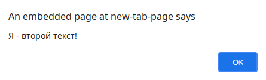

**`Есть другой способ выполнить эту проверку, используя тернарный оператор: (a > b) ? alert (а) : alert (б).`**

---

## Оператор else if

Мы видели **else**, мы видели **if**, пора встретиться с **else if**.

Оператор **else if** полезен тем, что он позволяет нам указать новое условие, если первое условие ложно.

Например вот так:

```JavaScript
var course = 1;

if (course == 1) {
    console.log("HTML туториал");
} else if (course == 2) {
    console.log("CSS туториал");
} else {
    console.log("JavaScript туториал");
}
```

Вот что происходит в приведенном выше коде:

- если `course` равен 1, вывести «HTML туториал;
- иначе, если `course` равен 2, вывести «CSS туториал;
- если ни одно из вышеперечисленных условий не выполняется, вывести «JavaScript туториал»;

`course` равен 1, поэтому получаем следующий результат:

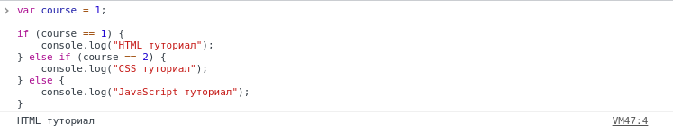

**`Последний оператор else "завершает" оператор else if и желательно всегда должен быть написан после операторов if и else if.`**

Последний блок **else** будет выполнен, если **ни одно** из условий не выполнено.

Давайте изменим значение переменной `course` в нашем предыдущем примере.

```JavaScript
var course = 3;

if (course == 1) {
    console.log("HTML туториал");
} else if (course == 2) {
    console.log("CSS туториал");
} else {
    console.log("JavaScript туториал");
}
```

**Результат:**

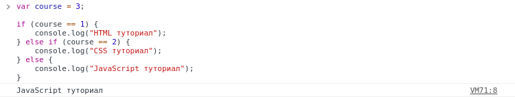

**`Вы можете написать столько операторов else if, сколько вам нужно.`**

---

## Switch

Но что, если вам нужно проверить несколько условий? В таких случаях написание операторов if else для каждого условия может быть не лучшим решением.

Вместо этого мы можем использовать оператор switch для выполнения разных действий в зависимости от разных условий.

Вот как это выглядит:

```JavaScript

switch (выражение) {
    case n1:
        ...
        break;
    case n2:
        ...
        break;
    default:
        ...
}
```

Выражение **switch** вычисляется один раз. Значение выражения сравнивается со значениями каждого случая (**case**), и если есть совпадение, этот блок кода выполняется.

**`Вы можете добиться того же результата с помощью нескольких операторов if ... else, но оператор switch в таких ситуациях более эффективен.`**

Давайте рассмотрим пример:

```JavaScript

var day = 2;
switch (day) {
    case 1:
        console.log("Понедельник");
        break;
    case 2:
        console.log("Вторник");
        break;
    case 3:
        console.log("Среда");
        break;
    default:
        console.log("Другой день");
}
```

**Результат:**

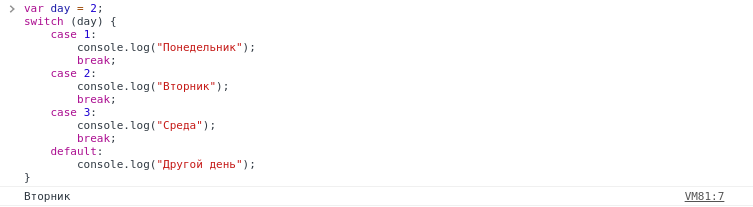

**`У вас может быть столько операторов case, сколько вам нужно.`**

---

## Ключевое слово break

Итак, мы узнали, что оператор switch проверяет блок кода, но мы не всегда хотим, чтобы он проверял весь блок. Ключевое слово **break** по существу прерывает оператор switch.

Прерывание блока switch останавливает выполнение большего количества кода и тестирования случаев внутри блока.

**`Обычно в каждом конкретном случае следует ставить break.`**

---

## Ключевое слово default

Часто совпадения не будет, но нам все равно нужна программа, чтобы что-то вывести ... для этого мы используем ключевое слово **default**, которое указывает код, который будет запускаться, если совпадения нет.

Пример:

```JavaScript

var color = "yellow";
switch (color) {
    case "blue":
        console.log("This is blue.");
        break;
    case "red":
        console.log("This is red");
        break;
    case "green":
        console.log("This is green");
        break;
    case "orange":
        console.log("This is orange");
        break;
    default:
        console.log("Color not found.");
}
```

**`Блок default можно опустить, если нет необходимости обрабатывать случай, когда совпадение не найдено.`**

---

## Циклы

Циклы могут выполнять блок кода несколько раз. Они удобны, если вы хотите запускать один и тот же код несколько раз, добавляя каждый раз новое значение.

В JavaScript есть три типа циклов: **for**, **while** и **do while**.

Мы начнем с классического цикла **for**.

**Вот синтаксис:**

```JavaScript

for (утверждение №1; утверждение №2; утверждение №3) {
    блок кода, который должен быть выполнен
}
```

И вот что происходит, когда он запускается:

**Утверждение №1** выполняется до начала цикла.
**Утверждение №2** определяет условие запуска цикла.
**Утверждение №3** выполняется каждый раз после выполнения цикла (то есть в конце каждой итерации).

---

## Цикл for

Так как выше мы разобрали теорию, рассмотрим пример. В этом примере создается цикл **for**, который печатает числа от 0 до 4:

```JavaScript
for ( i = 0; i < 5; i++ ) {
    console.log(i);
}
```

Так что же на самом деле происходит?

В этом примере **оператор №1** устанавливает переменную перед запуском цикла (var i = 0).
**Оператор №2** определяет условие запуска цикла (оно должно быть меньше 5).
**Оператор №3** увеличивает значение (i ++) каждый раз, когда выполняется блок кода в цикле.

**Результат:**

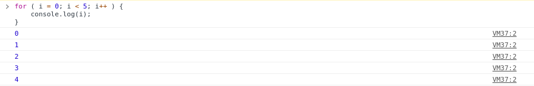

**Оператор №1** является необязательным и может быть опущено, если ваши значения установлены до начала цикла.

```JavaScript

var i = 0;
for ( ; i < 5; i++ ) {
    console.log(i);
}
```

Вы также можете использовать более одного значения в **операторе №1**, используя **запятые** для их разделения.

```JavaScript

for ( i = 0, text = ""; i < 5; i++ ) {
    text = i;
    console.log(i);
}
```

**`ES6 представляет другие типы циклов for; вы можете узнать о них позже в курсе ES6.`**

Если **оператор №2** вернет истину, начнётся следующая итерация, если он вернет ложь, цикл завершится.

Оператор №2 также необязателен, но только если вы поместите **break** внутри цикла. Иначе цикл никогда не закончится!

**Оператор №3** используется для изменения начальной переменной. Он может делать что угодно, включая отрицательное приращение (i--), положительное приращение (i = i + 15).

Оператор №3 также необязателен, но только если вы увеличиваете свои значения внутри цикла. Например так:

```JavaScript
var i = 0;

for ( ; ; ) {
    console.log(i++);

    if (i >= 10) break;
}
```

**Результат:**

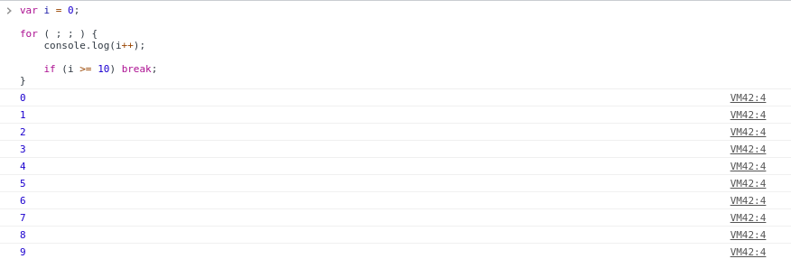

**`У вас может быть несколько вложенных циклов for.`**

---

## Цикл while

Пора перейти ко второму из наших трех операторов цикла, **while**.

Цикл **while** повторяется через блок кода, но только до тех пор, пока выполняется указанное условие.

**Вот синтаксис:**

```JavaScript
while (условие) {
    блок кода
}
```

**`Условие может быть любым условным оператором, возвращающим истину или ложь.`**

```JavaScript
var i = 0;

while (i < 10) {
    console.log(i);
    i++;
}
```

Цикл в этом коде будет продолжать выполняться, пока i меньше 10. И каждый раз, когда итерация запускается, i будет увеличиваться на 1.

Это выведет значения от 0 до 9.

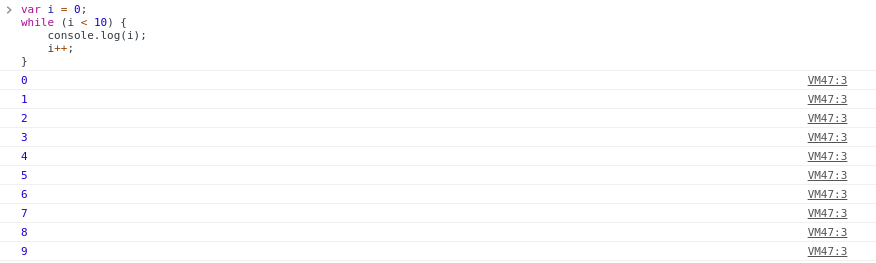

**`Будьте осторожны при написании условий. Если условие всегда истинно, цикл будет выполняться вечно!`**

Бесконечные циклы - это нехорошо. И одна из таких ситуаций - если мы забудем увеличить переменную, используемую в условии.

**`Убедитесь, что условие в цикле while в конечном итоге становится ложным.`**

---

# Цикл do while

Последний цикл, который мы рассматриваем в этом модуле, - это цикл **do ... while**, это вариант цикла while, но с одним важным отличием.

Этот цикл выполнит блок кода один раз, **прежде** чем проверять, истинно ли условие, а затем он будет повторять цикл до тех пор, пока условие истинно.

**Вот синтаксис:**

```JavaScript

do {
    блок кода
} while (условие);
```

**`Обратите внимание на точку с запятой, используемую в конце цикла do ... while. Это важно.`**

**Пример:**

```JavaScript
var i = 20;

do {
    console.log(i);
    i++;
} while ( i < 25 );
```

В этом примере выводятся числа от 20 до 25.

**Результат:**

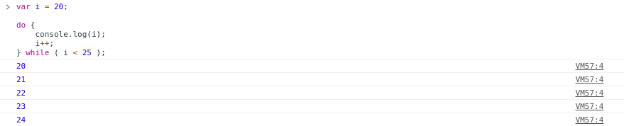

**`Цикл всегда будет выполняться хотя бы один раз, даже если условие ложно, потому что блок кода выполняется до проверки условия.`**

---

## Break

Мы встречали оператор **break** ранее в этом модуле, мы используем его, чтобы «выпрыгнуть» из цикла и продолжить выполнение кода после цикла.

**Наподобие этого:**

```JavaScript
for ( i = 0; i < 10; i++ ) {
    if ( i == 5 ) {
        break;
    }

    console.log(i);
}
```

В этом примере, как только i достигнет 5, он выйдет из цикла.

**Результат:**

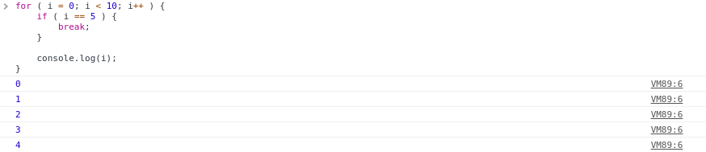

**`Вы можете использовать ключевое слово return для немедленного возврата некоторого значения из цикла внутри функции. Это также разорвет петлю.`**

---

## Continue

В отличие от оператора **break**, оператор **continue** прерывает только одну итерацию цикла и продолжает следующую итерацию.

**Пример:**

```JavaScript
for ( i = 0; i < 10; i++ ) {
    if ( i == 5 ) {
        continue;
    }

    console.log(i);
}
```

**Результат:**

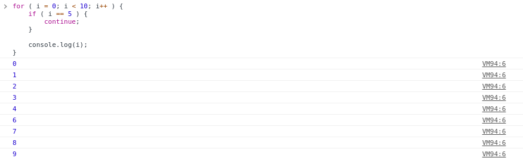

**`Значение 5 не печатается, потому что continue пропускает эту итерацию цикла.`**

---

## _Практика: Улитка в колодце_

Улитка поднимается на 7 футов каждый день и каждую ночь скользит на 2 фута.
За сколько дней улитка выберется из колодца заданной глубины?

```JavaScript
function main() {
    var depth = parseInt(readLine(), 10);
    // Ваш код ...

}
```

**Пример ввода:** 31
**Пример вывода:** 6

```
Пояснение: Давайте разберем расстояние, которое улитка преодолевает каждый день:
День 1: 7-2=5
День 2: 5+7-2=10
День 3: 10+7-2=15
День 4: 15+7-2=20
День 5: 20+7-2=25
День 6: 25+7=32

Итак, в День 6 улитка достигнет 32 футов и вылезет из колодца днем, не соскользнув назад в ту ночь.
```

**`Подсказка: вы можете использовать цикл, чтобы рассчитать расстояние, которое улитка преодолевает каждый день, и разорвать петлю, когда она достигнет желаемого расстояния.`**

Готовый код можно посмотреть по этой [ссылке](the_snail_in_the_well.js)
