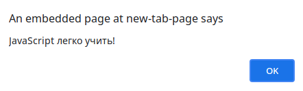
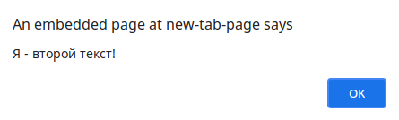
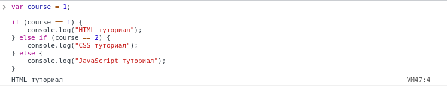
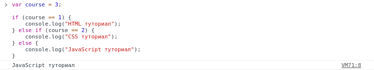
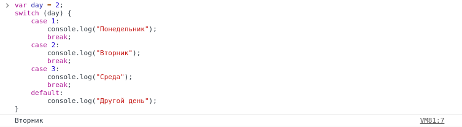

# Условные выражения и циклы 

## Оператор if

Часто, когда мы пишем код, мы хотим выполнять разные действия в зависимости от разных условий.

И здесь на помощь приходят **условные выражения**.

Существует множество различных условных выражений, но мы начнем с одного из самых полезных: "если"

Мы используем **if**, чтобы указать блок кода, который мы хотим выполнить, если заданное условие истинно.

```JavaScript

if (условие) {
    ...
}
```

Операторы будут выполняться только в том случае, если указанное условие истинно. Давайте рассмотрим на пример:

```JavaScript
var myNum1 = 7;
var myNum2 = 10;

if (myNum1 < myNum2) {
    alert("JavaScript легко учить!");
}
```

**Результат:**



Вот еще немного подробностей об операторе if.

Это пример ложного условного оператора:

```JavaScript
var myNum1 = 7;
var myNum2 = 10;

if (myNum1 > myNum2) {
    alert("JavaScript легко учить!");
}
```

Поскольку условие оценивается как ложное, оператор предупреждения пропускается, и программа продолжает выполнение строки, следующей за закрывающей фигурной скобкой оператора if.

**`if пишется строчными буквами. If или IF - не работают.`**

---

## Оператор else

Итак, мы видели, что действие пропускается, когда блок кода, использующий оператор if, оценивается как false. Но что, если мы хотим обработать оба случая: когда выражение в if истинно и когда оно ложно? Ну, конечно же, мы используем оператор else!

Мы можем использовать оператор else, чтобы указать блок кода, который будет выполняться, если условие ложно. Как это:

```JavaScript
if (условие) {
    // Код, который выполнится, если условие истинно (true)
} else {
    // Код, который выполнится, если условие ложно (false)
}
```

**`Вы можете пропустить фигурные скобки, если код при условии содержит только одну команду.`**

Вот еще пример совместной работы операторов **if** и **else**:

```JavaScript
var myNum1 = 7;
var myNum2 = 10;

if (myNum1 > myNum2) {
    alert("Я - первый текст!");
} else {
    alert("Я - второй текст!");
}
```

Давайте разберём этот пример. Он говорит:
- **Если** `myNum1` больше `myNum2`, браузер выведет «Я - первый текст!»;
- ** Иначе**, браузер выведет «Я - второй текст!».

 Таким образом, браузер выведет второе условие, так как 7 не больше 10.

**Результат:**



**`Есть другой способ выполнить эту проверку, используя тернарный оператор: (a > b) ? alert (а) : alert (б).`**

---

## Оператор else if

Мы видели **else**, мы видели **if**, пора встретиться с **else if**.

Оператор **else if** полезен тем, что он позволяет нам указать новое условие, если первое условие ложно.

Например вот так:

```JavaScript
var course = 1;

if (course == 1) {
    console.log("HTML туториал");
} else if (course == 2) {
    console.log("CSS туториал");
} else {
    console.log("JavaScript туториал");
}
```

Вот что происходит в приведенном выше коде:
- если `course` равен 1, вывести «HTML туториал;
- иначе, если `course` равен 2, вывести «CSS туториал;
- если ни одно из вышеперечисленных условий не выполняется, вывести «JavaScript туториал»;

`course` равен 1, поэтому получаем следующий результат:



**`Последний оператор else "завершает" оператор else if и желательно всегда должен быть написан после операторов if и else if.`**

Последний блок **else** будет выполнен, если **ни одно** из условий не выполнено.

Давайте изменим значение переменной `course` в нашем предыдущем примере.

```JavaScript
var course = 3;

if (course == 1) {
    console.log("HTML туториал");
} else if (course == 2) {
    console.log("CSS туториал");
} else {
    console.log("JavaScript туториал");
}
```

**Результат:**



**`Вы можете написать столько операторов else if, сколько вам нужно.`**

---

## Switch

Но что, если вам нужно проверить несколько условий? В таких случаях написание операторов if else для каждого условия может быть не лучшим решением.

Вместо этого мы можем использовать оператор switch для выполнения разных действий в зависимости от разных условий.

Вот как это выглядит:

```JavaScript

switch (выражение) {
    case n1:
        ...
        break;
    case n2:
        ...
        break;
    default: 
        ...
}
```

Выражение **switch** вычисляется один раз. Значение выражения сравнивается со значениями каждого случая (**case**), и если есть совпадение, этот блок кода выполняется.

**`Вы можете добиться того же результата с помощью нескольких операторов if ... else, но оператор switch в таких ситуациях более эффективен.`**

Давайте рассмотрим пример:

```JavaScript

var day = 2;
switch (day) {
    case 1:
        console.log("Понедельник");
        break;
    case 2:
        console.log("Вторник");
        break;
    case 3:
        console.log("Среда");
        break;
    default:
        console.log("Другой день");
}
```

**Результат:**



**`У вас может быть столько операторов case, сколько вам нужно.`**

---

## Ключевое слово break

