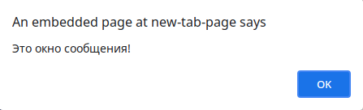
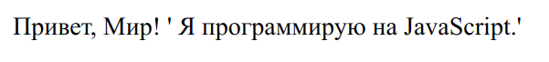

# Введение

## Добро пожаловать в JavaScript

Нужно ли нам вообще изучать **JavaScript**? Это один из самых популярных языков программирования на планете!

Вы когда-нибудь посещали веб-сайт, который заставлял вас думать... «Эй, этот веб-сайт действительно классный и интерактивный»? Что ж, вероятно, это произошло с помощью JavaScript.

Так это просто полезно для веб-сайтов? Неправильный! Обработка данных, мобильные и настольные приложения, игры - ваш мир с помощью JavaScript. 

---

## На старт. Внимание. JavaScript!

Давайте начнем с основ и добавим JavaScript на веб-страницу.

В Интернете код JavaScript находится внутри HTML-документа и должен быть заключен в теги **`<script>`** и **`</script>`**:
```html
<script>
...
</script>
```
**`Вы можете поместить тег скрипта в любом месте HTML-документа.`**

---

## Вывод
Давайте воспользуемся JavaScript, чтобы напечатать «Привет, Мир!» в браузере. Вот как бы это выглядело:
```html
<script>
    document.write("Привет, Мир!");
</script>
```

Заметили что-то новенькое? Ничто не пройдёт мимо вас!

Пришло время представить функцию **`document.write()`**. Это то, что нам нужно использовать для записи текста в наш HTML-документ.

Хотите поэкспериментировать? Дерзайте! Вы можете использовать стандартный язык разметки HTML для настройки внешнего вида текста в выводе:

```html
<script>
    document.write("<h1>Привет, Мир!</h1>");
</script>
```

**`document.write() следует использовать только для тестирования. Мы скоро рассмотрим некоторые другие механизмы вывода.`**

---

## Вывод в консоль

Итак, теперь мы эксперты в написании вывода HTML с помощью document.write ().
Время для другого типа вывода. Давайте узнаем о выводе в консоль браузера.

Для этого нам понадобится надежная функция **`console.log()`**.

Подожди, не так быстро! О какой консоли мы говорим?

Консоль является частью веб-браузера и позволяет регистрировать сообщения, запускать код JavaScript и просматривать ошибки и предупреждения.

**Это выглядит так:**

```JavaScript
console.log("Привет из консоли!");
```

**`Разработчики в основном используют консоль для тестирования своего кода JavaScript.`**

---

## Переменные

**Переменные** - это контейнеры для хранения значений данных. Значение переменной может изменяться на протяжении всей программы.

Объявить переменную так же просто, как использовать ключевое слово **`var`**. Это выглядело бы так:

```JavaScript
var x = 10;
```

В этом примере мы присвоили переменной **x** значение **10**.

Здесь мы использовали слово «присвоено» намеренно, потому что в JavaScript знак равенства (=) на самом деле называется оператором **«присваивания»**, а не оператором «равно».

Это означает, что в JavaScript **x = y** присвоит значение **y** переменной **x**.

**`JavaScript чувствителен, то есть чувствителен к регистру. Таким образом, такие переменные, как lastName и lastname, не совпадают.`**

---

## Использование переменных

Хорошо, давайте объединим то, что мы узнали!

Как насчет того, чтобы присвоить значение переменной и вывести его в браузер. Мы можем сделать это так:

```JavaScript
var x = 100;

document.write(x);
```

Но в чем вообще смысл переменных? Что ж, представьте, что ваша программа имеет 1000 строк кода, которые включают переменную x. С помощью переменных вы можете изменять значения переменных и многократно использовать их в своем коде:

Например так:
```JavaScript
var x = 100;
console.log(x); // 100

x = 42;
console.log(x); // 42
```

**`Каждая письменная «инструкция» называется оператором. Операторы JavaScript разделяются точкой с запятой.`**

---

## Имена переменных

Поговорим об именах.
Очень важно помнить, что имена переменных JavaScript чувствительны к регистру.

Как вы думаете, каким будет результат следующего кода?
```JavaScript
var x = 10;
console.log(X);
```

Верно! Ошибка. Это потому, что x и X разные, и мы не объявляли переменную X.

Приготовьтесь к новым правилам!
- Первым символом имени переменной **должна быть** буква, знак подчеркивания (_) или знак доллара ($) (последующие символы могут быть буквами, цифрами, знаками подчеркивания или знаками доллара);
- Первый символ имени переменной **не может быть** числом;
- В именах переменных **нельзя** использовать **математические или логические операторы**. Например, `2*something` или `this+that`;
- Имена переменных **не должны содержать пробелов**;
- Вам не разрешается использовать какие-либо специальные символы, например `my#num`, `num%` и т. Д.

**`JavaScript - это зона, свободная от дефисов. Они зарезервированы для вычитания.`**

---

## Комментарии в JavaScript

Хорошо, давайте поговорим о **комментариях** в JavaScript.
Итак, мы знаем об операторах, это инструкции в нашей программе, которые «выполняются» при запуске программы.
Но! Не все операторы JavaScript «выполняются».
Любой код после двойной косой черты `//` или между `/*` и `*/` рассматривается как **комментарий**, игнорируется и не выполняется.

Чтобы написать **однострочный** комментарий, мы используем двойную косую черту. Например так:

```JavaScript
// Это однострочный комментарий
alert("Это окно сообщения!");
```

**Результат:**



Но зачем писать код, который никогда не будет выполнен. Разве это не пустая трата времени?
Нисколько! Комментарии - это классная вещь, особенно если дело касается больших функций, поскольку они помогают сделать наш код более читаемым для других. Так что будьте добры и комментируйте!

**`alert() используется для создания окна сообщения.`**

---

## Многострочные комментарии

Что, если мы хотим прокомментировать больше, чем на одну строку?

Если мы хотим создать многострочный комментарий, мы пишем его между `/*` и `*/`. **Например так :**

```JavaScript
/*  Этот код
    создаёт окно
    сообщения  */
alert("Это окно сообщения!");
```

**`Мы используем комментарии, чтобы описать и объяснить, что делает код.`**

---

## Типы данных

Термин **тип данных** относится к типам значений, с которыми может работать программа. Переменные JavaScript безграничны, они могут содержать кучу различных типов данных - **числа**, **строки**, **массивы** и т.д.

Но давайте начнем с простого.
Числа можно писать с десятичными знаками или без них. Например так:

```JavaScript
var x = 42; // Число без десятичных знаков  

var price = 55.55; // Число с десятичными знаками
```

**`Изменить переменную очень просто, просто присвойте ей любое другое значение типа данных, например.`**

```JavaScript
var x = 42;

num = 'какая-то рандомная строка';
```

---

## Строки 

Окей, поддадим жару...
В JavaScript мы можем использовать **строки** для хранения текста и управления им.
Строкой может быть любой текст, заключенный в **кавычки**. Одиночные или двойные кавычки не имеют значения, главное чтобы они . Например так:

```JavaScript
var name = 'Иван';
var text = "Меня зовут Иван Иванов"
```
Что, если мы хотим использовать кавычки внутри строки? Без проблем! Вы можете использовать кавычки внутри строки, если они не совпадают с кавычками, заключающими саму строку. Пример:

```JavaScript
var text = "Меня зовут 'Иван' ";
```

**`Вы можете получить двойные кавычки внутри двойных кавычек, используя символ экранирования, например: \" или \' внутри одинарных кавычек.`**

```JavaScript
var text = "Меня зовут \" Иван \" ";
```

Самое время поговорить о символе экранирования (обратная косая черта `\`). Он приходит на помощь, когда вам нужно заключить в кавычки строки (и множество других ситуаций), преобразовывая специальные символы в строковые символы.

```JavaScript
var sayHello = 'Привет, Мир! \' Я программирую на JavaScript.\' ';
document.write(sayHello);
```

Результат: 



Но символ экранирования (`\`) предназначен не только для кавычек, он работает, когда вам нужно поместить другие специальные символы в строки!

| Код | Вывод |
| - | -|
| `\'` | Одинарная кавчка |
| `\"` | Двойная кавчка |
| `\\` | Обратная косая черта |
| `\n` | Перевод строки |
| `\r` | Возврат каретки |
| `\t` | Горизонтальная табуляция |
| `\b` | Возврат на шаг |
| `\f` | Прогон страницы, смена страницы  |

**`Если вы начинаете строку с одинарной кавычки, вам также нужно заканчивать ее одинарной кавычкой. Это касается и двойных кавычек. Иначе JavaScript запутается.`**

---

## Булево значение (boolean)

Логические значения в JavaScript выполняют полезную функцию, предоставляя вам одно из двух значений: **истинное** или **ложное**.

Поэтому, когда вам нужен тип данных, который может иметь только одно из двух возможных значений, например `Да / Нет`, `вкл / выкл` или `истина / ложь`, используйте **`boolean`**. Давайте посмотрим на пример:

```JavaScript
var isActive = true;
var isHoliday = false;
```

**`Логическое значение 0 (ноль), null, undefined, пустая строка - false.
Все, что имеет «настоящее» значение (например 1 или 'Привет') - true.`**
